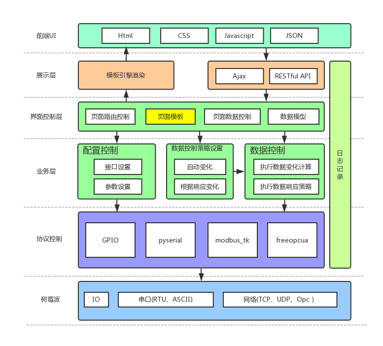

# 详细设计

## 目录

- [详细设计](#%E8%AF%A6%E7%BB%86%E8%AE%BE%E8%AE%A1)
    - [目录](#%E7%9B%AE%E5%BD%95)
    - [功能实现](#%E5%8A%9F%E8%83%BD%E5%AE%9E%E7%8E%B0)
        - [IO](#io)
        - [串口](#%E4%B8%B2%E5%8F%A3)
        - [Modbus](#modbus)
        - [OpcUa](#opcua)
    - [总体方案](#%E6%80%BB%E4%BD%93%E6%96%B9%E6%A1%88)
        - [系统总体层级设计](#%E7%B3%BB%E7%BB%9F%E6%80%BB%E4%BD%93%E5%B1%82%E7%BA%A7%E8%AE%BE%E8%AE%A1)
        - [系统接口设计](#%E7%B3%BB%E7%BB%9F%E6%8E%A5%E5%8F%A3%E8%AE%BE%E8%AE%A1)
            - [硬件接口](#%E7%A1%AC%E4%BB%B6%E6%8E%A5%E5%8F%A3)
                - [GPIO](#gpio)
                - [串口](#%E4%B8%B2%E5%8F%A3)
                - [modbus](#modbus)
            - [后端接口](#%E5%90%8E%E7%AB%AF%E6%8E%A5%E5%8F%A3)
                - [配置项](#%E9%85%8D%E7%BD%AE%E9%A1%B9)
                - [GPIO相关功能](#gpio%E7%9B%B8%E5%85%B3%E5%8A%9F%E8%83%BD)
                - [串口相关功能](#%E4%B8%B2%E5%8F%A3%E7%9B%B8%E5%85%B3%E5%8A%9F%E8%83%BD)
                - [modbus相关功能](#modbus%E7%9B%B8%E5%85%B3%E5%8A%9F%E8%83%BD)
            - [前端接口](#%E5%89%8D%E7%AB%AF%E6%8E%A5%E5%8F%A3)
    - [模块详细设计](#%E6%A8%A1%E5%9D%97%E8%AF%A6%E7%BB%86%E8%AE%BE%E8%AE%A1)

## 功能实现

### IO

可以对IO做配置，可以配置的内容有:
1. 总共16个GPIO口的输入输出设置。
1. 输入IO的最低有效脉冲时间。
1. 输出IO的高低电平持续时间，可以设置常高或常低。
1. 在输入为高或低的情况下，执行一些动作(优先度低)，比如
    1. 修改其他IO的状态
    1. 发送串口数据
    1. 修改Modbus参数
    1. 修改OpcUa参数
1. 界面按钮可以直接控制高低

### 串口

1. 可以设置每个串口的波特率，停止位，校验位。
1. 可以设置ASCII模式还是整数模式，在ASCII模式下发送的信息包括数字都是ASCII码，在整数模式下只能发送数字。
1. 可以设置串口每隔一定时间发送设置好的信息。
1. 可以设置串口在接收到某个数据时发送对应设置好的数据。

### Modbus

1. 支持ModBusRTU和ModBusTCP。
1. 可以设置任意数量的从机地址(slave)，每个从机地址都可以分别进行设置。
1. 功能码支持线圈读写(1、5、15)，设置离散输入状态(2)，读写保持寄存器(3、6、16)，读取输入寄存器(4)。
1. 可以对各个数据进行设置，可设置数据的变化趋势和间隔。(后期更改为设置这个数据的变更条件和变更目标值和增量)。
1. 从机上已设置寄存器数据展示，按照地址从小到大顺序展示。
1. 从机上线圈和离散输入状态开关展示。

### OpcUa

1. 设置IP和端口
1. 设置节点地址和数值
1. 可以对各个数据进行设置，可设置数据的变化趋势和间隔。(后期更改为设置这个数据的变更条件和变更目标值和增量)。
1. 界面上已设置的节点和数据展示。

## 总体方案

### 系统总体层级设计

### 系统接口设计

#### 硬件接口

##### GPIO

GPIO口有16个，可以通过导入Rpi.GPIO来使用，接口参数包括:

| 功能             | 接口             | 参数                                         |
| ---------------- | ---------------- | -------------------------------------------- |
| 设置gpio的模式   | `GPIO.setmode()` | 模式名，内部使用                             |
| 设置gpio口的参数 | `GPIO.setup()`   | 接口名，输入输出设置，上下拉设置(一般in需要) |
| 获取输入数据的值 | `GPIO.input()`   | GPIO口编号                                   |
| 对gpio口赋值     | `GPIO.output()`  | gpio口编号，电压值                           |

---

##### 串口

串口在树莓派板卡上只有一个，但是可以通过USB口扩展，或直接控制GPIO口作为串口使用，可以通过导入pyserial来支持串口，接口包括:

| 功能         | 接口              | 参数                                       | 备注 |
| ------------ | ----------------- | ------------------------------------------ | ---- |
| 串口的实例   | `serial.Serial()` | port，baudrate，parity，stopbits，bytesize |      |
| 读取串口数据 | `ser.read()`      | 读取数据的数量                             |      |
| 写入串口数据 | `ser.write()`     | 换行符需要转换为ASCII                      |      |

> 在串口延时有问题时，可以设置串口的timeout属性，用来设置最大读取延时。另外使用writeTimeout用来设置写入延时。

---

##### modbus

modbus协议可以通过串口(ModbusRTU)和网口(ModbusTCP)来进行通信，可以通过导入modbus_tk来实现相关协议，在使用时除进行实例化时所用的接口不同外，其他用法均相同，接口如下:

| 功能        | 接口                                        | 参数                                 | 备注 |
| ----------- | ------------------------------------------- | ------------------------------------ | ---- |
| 添加RTU服务 | `modbus_rtu.RtuServer(serial.Serial(PORT))` | 串口实例                             |      |
| 添加TCP服务 | `modbus_tcp.TcpServer()`                    | 无                                   |      |
| 添加从机    | `server.add_slave()`                        | 从机名称或编号                       |      |
| 添加数据块  | `slave.add_block()`                         | 数据块名称，功能，开始地址，结束地址 |      |
| 写入数据    | `slave.set_values()`                        | 数据块名称，开始地址，数据           |      |
| 读取数据    | `slave.get_values()`                        | 数据块名称，开始地址，读取地址数量   |      |

#### 后端接口

后端接口主要是对于硬件端接口的封装，简化调用操作，增加功能和执行流程。同时对各类数据和日志进行持久化操作。在工作中根据前端REST接口返回值，并根据post内容来向硬件写入数据。

通用工具:
| 功能 | 接口 | 参数 | 返回值 | 备注 |
| ---- | ---- | ---- | ------ | ---- |
|      |      |      |        |      |

---

##### 配置项

主要是对接口的一些参数进行配置，必要时对数据进行初始化

| 功能                | 接口                              | 参数                   | 返回值   | 备注                         |
| ------------------- | --------------------------------- | ---------------------- | -------- | ---------------------------- |
| 添加GPIO口及参数    | `io_create(dict)`                 | 接口编号和输入输出设置 | 成功与否 |                              |
| GPIO上下拉设置      | `io_pull_set(list)`               | 接口编号               | 成功与否 | 自动设置上拉还是下拉         |
| 串口属性配置        | `serial_setup(dict)`              | 串口的各类参数         | 成功与否 |                              |
| 串口数据类型配置    | `serial_set_number()`             | 无                     | 成功与否 | 默认使用ASCII执行后传数值    |
| modbusRTU服务建立   | `modbus_rtu_create(name)`         | 服务名称               | 成功与否 |                              |
| modbusTCP服务建立   | `modbus_tcp_create(name)`         | 服务名称               | 成功与否 |                              |
| modbus删除服务      | `modbus_delete(name)`             | 服务名称               | 成功与否 |                              |
| modbus添加从机      | `modbus_add_slave(list)`          | 从机名列表             | 成功与否 |                              |
| modbus删除从机      | `modbus_delete_slave(name)`       | 从机名                 | 成功与否 |                              |
| modbus添加数据块    | `modbus_add_block(slave,blocks)`  | 从机名，块list         | 成功与否 | 有名称、功能、开始地址和大小 |
| modbus删除数据块    | `modbus_delete_block(slave,name)` | 从机名，块名称         | 成功与否 |                              |
| opcua添加服务       | `opc_create(name，port)`          | 名称和端口号           | 成功与否 |                              |
| opcua删除服务       | `opc_delete(name)`                | 名称                   | 成功与否 |                              |
| opcua添加节点和类型 | `opc_add_node(list)`              | 节点列表               | 成功与否 | 包含名称、类型等             |
| opcua删除节点和类型 | `opc_add_node(name)`              | 节点名称               | 成功与否 |                              |

---

##### GPIO相关功能

| 功能             | 接口                         | 参数                           | 返回值   | 备注                     |
| ---------------- | ---------------------------- | ------------------------------ | -------- | ------------------------ |
| 设置输出接口数据 | `io_outputs_set(dict)`       | 接口编号和输出数据             | 成功与否 |                          |
| 读取输入接口数据 | `io_inputs_get(list)`        | 接口编号，默认全部io接口       |          | dict包含接口编号和对应值 |
| ~~转换节拍设置~~ | ~~`io_switch_status(list)`~~ | ~~接口编号和高低电平持续时间~~ |          | ~~用线程池控制~~         |
| io上升下降沿事件 | `io_event(dict?)`            | 接口编号和需要执行的API        |          |                          |

---

##### 串口相关功能

| 功能             | 接口                                                       | 参数                     | 返回值       | 备注                         |
| ---------------- | ---------------------------------------------------------- | ------------------------ | ------------ | ---------------------------- |
| 持续写入数据     | `serial_repeat(data,time)`                                 | 数据，间隔               | 无           |                              |
| 读取数据         | `serial_read()`                                            | 无                       | 读取到的数据 | 可以设置在界面实时显示       |
| 添加数据响应配置 | `serial_responds(responds_name,dict)`                      | 名称，读取和输出数据字典 | 成功与否     | 内部dict增量存储             |
| 删除数据响应配置 | `serial_delete_responds(responds_name,read_data)`          | 名称，读取的单条数据     | 成功与否     | 按照key删除dict条目          |
| 切换数据响应配置 | `serial_switch_responds(responds_name)`                    | 响应类型名称             | 成功与否     |                              |
| 添加虚拟设备     | `serial_add_device(name)`                                  | 设备名称                 | 成功与否     |                              |
| 删除虚拟设备     | `serial_add_device(name)`                                  | 设备名称                 | 成功与否     |                              |
| 切换虚拟设备     | `serial_switch_device(name)`                               | 设备名称                 | 成功与否     | 可以用切换虚拟设备响应的那个 |
| 添加虚拟设备响应 | `serial_add_device_pattern(device_name,respond_name,dict)` | 响应名称、响应dict       | 成功与否     |                              |
| 删除虚拟设备响应 | `serial_delete_device_pattern(device_name,respond_name)`   | 响应名称、响应dict       | 成功与否     |                              |
| 切换虚拟设备响应 | `serial_switch_device_pattern(device_name,respond_name)`   | 设备名称                 | 成功与否     |                              |

> 虚拟设备部分，在后期实现，是为了保存虚拟设备的各种状态，并便于切换。

---

##### modbus相关功能

| 功能             | 接口                                                       | 参数                     | 返回值     | 备注             |
| ---------------- | ---------------------------------------------------------- | ------------------------ | ---------- | ---------------- |
| 不同功能读取数据 | `modbus_<function_name>_read(slave,block,address,length)`  | 从机名，块名，地址，长度 | 请求的数据 |                  |
| 不同功能写入数据 | `modbus_<function_name>_write(slave,block,address,length)` | 从机名，块名，地址，长度 | 请求的数据 |                  |
| 添加数据响应配置 | `modbus_responds(responds_name,dict)`                      | 读取和输出数据的dict     | 成功与否   | 内部dict增量存储 |
| 删除数据响应配置 | `modbus_delete_responds(responds_name,read_data)`          | 读取的单条数据           | 成功与否   | 按照key删        |
| 切换数据响应配置 | `modbus_switch_responds(responds_name)`                    | 响应类型名称             | 成功与否   |                  |

#### 前端接口

RESTful接口:使用URL定位资源，用HTTP动词描述操作。

| HTTP动词  | 意义     |
| --------- | -------- |
| GET       | 获取资源 |
| POST      | 新建资源 |
| PUT/PATCH | 更新资源 |
| DELETE    | 删除资源 |

> 返回的HTTP Status Code 表示访问状态。

下面没有特殊说明的话，就只描述的是资源

| 资源名           | URL                                               | 备注                                                          |
| ---------------- | ------------------------------------------------- | ------------------------------------------------------------- |
| IO口参数         | `/api/io/setting/`                                | 数据包括每个io的各项属性                                      |
| IO接口状态       | `/api/io/<io_id>`                                 | 用ios返回所有数据                                             |
| IO事件           | `/api/io/setting/<io_id>/<event_id>`              | 触发事件的IO(ios/events返回所有的)，上升还是下降沿，执行的API |
| 串口参数         | `/api/serial/setting/`                            | 数据包括串口的各项属性和数据类型                              |
| 串口虚拟设备     | `/api/serial/setting/<device>`                    | 设置或显示正在使用的虚拟设备名称，用PUT就可以切换虚拟设备     |
| 串口虚拟设备事件 | `/api/serial/setting/device/<event_name>`         | 串口虚拟设备的数据触发条件，包括数据响应条件和响应信息        |
| 串口输入输出数据 | `/api/serial/data/`                               | 串口数据的历史记录，GET获取输入输出历史数据，POST发送数据     |
| modbus服务       | `/api/modbus/setting/`                            | 数据包括串口号或ip和端口号                                    |
| modbus从机       | `/api/modbus/setting/slaves/`                     | 数据包括从机名称                                              |
| modbus功能       | `/api/modbus/setting/<slave>/function/`           | 数据包括功能的设置信息                                        |
| modbus数据块     | `/api/modbus/setting/<slave>/<function>/<block>/` | 数据包括数据块的名称、开始地址和大小                          |
| modbus从机配置   | `/api/modbus/setting/<slave>/`                    | 设置或显示modbus从机设备，可以添加和切换(改名)等操作          |
| modbus事件配置   | `/api/modbus/setting/<slave>/<event>/`            | modbus虚拟设备事件，可以对每个block进行单独设置               |
| modbus数据       | `/api/modbus/<slave>/<function>/<block>/`         | 用blocks就返回所有的block                                     |
| opcua服务        | `/api/opc/setting/`                               |                                                               |
| opcua节点        | `/api/opc/setting/<node>/`                        |                                                               |
| opcua节点数据    | `/api/opc/<node>/`                                |                                                               |

## 模块详细设计

