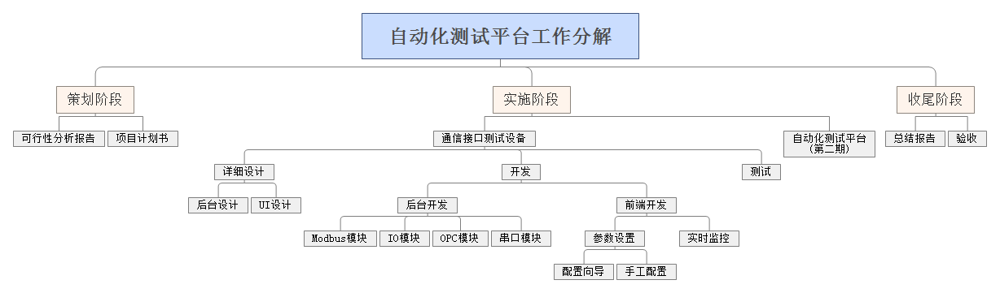
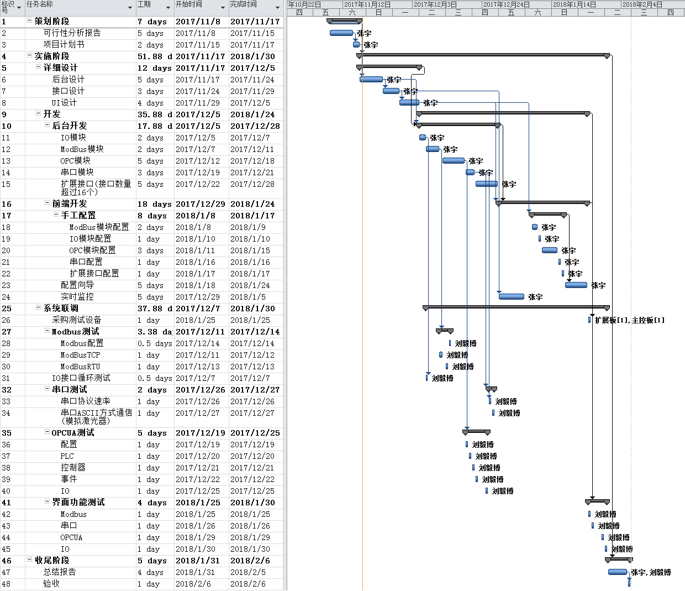
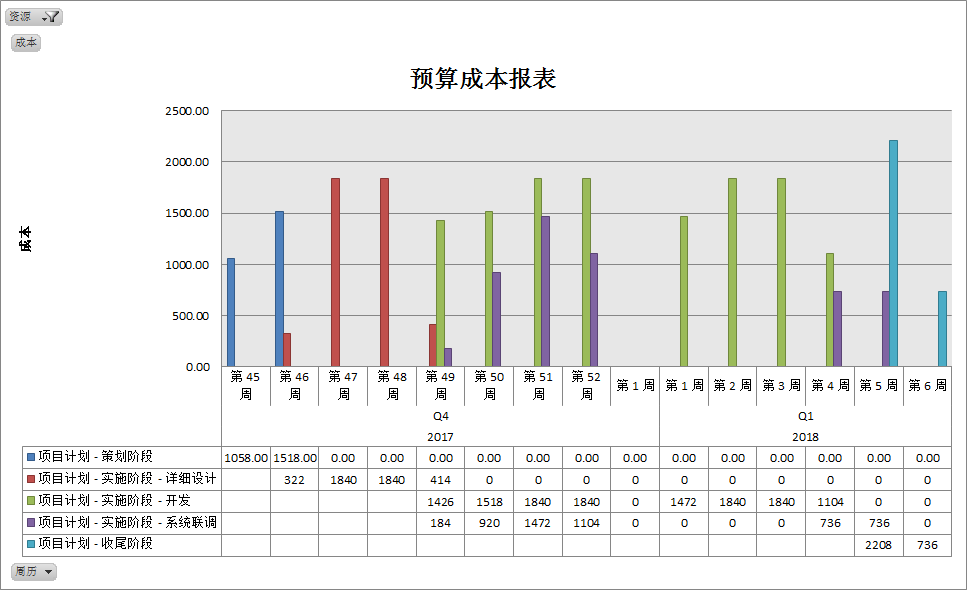

## 角色职责

## 项目工作分解

## 进度计划

[进度计划原始文件](./img/项目计划.mpp)

|标识号|WBS|任务名称|工期|开始时间|完成时间|前置任务|资源名称|
|---|---|---|---|---|---|---|---|
|1|1|策划阶段|7days|2017/11/8|2017/11/17|||
|2|1.1|可行性分析报告|5days|2017/11/8|2017/11/15||张宇|
|3|1.2|项目计划书|2days|2017/11/15|2017/11/17|2|张宇|
|4|2|实施阶段|51.88days|2017/11/17|2018/1/30|1||
|5|2.1|详细设计|12days|2017/11/17|2017/12/5|||
|6|2.1.1|后台设计|5days|2017/11/17|2017/11/24|3|张宇|
|7|2.1.2|接口设计|3days|2017/11/24|2017/11/29|6|张宇|
|8|2.1.3|UI设计|4days|2017/11/29|2017/12/5|7|张宇|
|9|2.2|开发|35.88days|2017/12/5|2018/1/24|||
|10|2.2.1|后台开发|17.88days|2017/12/5|2017/12/28|"6,5"||
|11|2.2.1.1|IO模块|2days|2017/12/5|2017/12/7||张宇|
|12|2.2.1.2|ModBus模块|2days|2017/12/7|2017/12/11||张宇|
|13|2.2.1.3|OPC模块|5days|2017/12/12|2017/12/18||张宇|
|14|2.2.1.4|串口模块|3days|2017/12/19|2017/12/21||张宇|
|15|2.2.1.5|扩展接口(接口数量超过16个)|5days|2017/12/22|2017/12/28||张宇|
|16|2.2.2|前端开发|18days|2017/12/29|2018/1/24|"8,10"||
|17|2.2.2.1|手工配置|8days|2018/1/8|2018/1/17|8||
|18|2.2.2.1.1|ModBus模块配置|2days|2018/1/8|2018/1/9||张宇|
|19|2.2.2.1.2|IO模块配置|1day|2018/1/10|2018/1/10||张宇|
|20|2.2.2.1.3|OPC模块配置|3days|2018/1/11|2018/1/15||张宇|
|21|2.2.2.1.4|串口配置|1day|2018/1/16|2018/1/16||张宇|
|22|2.2.2.1.5|扩展接口配置|1day|2018/1/17|2018/1/17||张宇|
|23|2.2.2.2|配置向导|5days|2018/1/18|2018/1/24|17|张宇|
|24|2.2.2.3|实时监控|5days|2017/12/29|2018/1/5|7|张宇|
|25|2.3|系统联调|37.88days|2017/12/7|2018/1/30|||
|26|2.3.1|采购测试设备|1day|2018/1/25|2018/1/25|9|"扩展板[1],主控板[1]"|
|27|2.3.2|Modbus测试|3.38days|2017/12/11|2017/12/14|12||
|28|2.3.2.1|Modbus配置|0.5days|2017/12/14|2017/12/14||刘毅博|
|29|2.3.2.2|ModBusTCP|1day|2017/12/11|2017/12/12||刘毅博|
|30|2.3.2.3|ModBusRTU|1day|2017/12/13|2017/12/13||刘毅博|
|31|2.3.3|IO接口循环测试|0.5days|2017/12/7|2017/12/7|11|刘毅博|
|32|2.3.4|串口测试|2days|2017/12/26|2017/12/27|14||
|33|2.3.4.1|串口协议速率|1day|2017/12/26|2017/12/26|14|刘毅博|
|34|2.3.4.2|串口ASCII方式通信(模拟激光器)|1day|2017/12/27|2017/12/27||刘毅博|
|35|2.3.5|OPCUA测试|5days|2017/12/19|2017/12/25|13||
|36|2.3.5.1|配置|1day|2017/12/19|2017/12/19||刘毅博|
|37|2.3.5.2|PLC|1day|2017/12/20|2017/12/20||刘毅博|
|38|2.3.5.3|控制器|1day|2017/12/21|2017/12/21||刘毅博|
|39|2.3.5.4|事件|1day|2017/12/22|2017/12/22||刘毅博|
|40|2.3.5.5|IO|1day|2017/12/25|2017/12/25||刘毅博|
|41|2.3.6|界面功能测试|4days|2018/1/25|2018/1/30|16||
|42|2.3.6.1|Modbus|1day|2018/1/25|2018/1/25||刘毅博|
|43|2.3.6.2|串口|1day|2018/1/26|2018/1/26||刘毅博|
|44|2.3.6.3|OPCUA|1day|2018/1/29|2018/1/29||刘毅博|
|45|2.3.6.4|IO|1day|2018/1/30|2018/1/30||刘毅博|
|46|3|收尾阶段|5days|2018/1/31|2018/2/6|4||
|47|3.1|总结报告|4days|2018/1/31|2018/2/5||"张宇,刘毅博"|
|48|3.2|验收|1day|2018/2/6|2018/2/6|47||

## 项目成本资源计划
### 工具和环境资源需求及预算
> 开发阶段主要需要购买树莓派板卡(包括必要的周边设备)加扩展板，预计900RMB

### 项目人力资源综合费用预算
> 总费用为:27068RMB

### 费用合计
|项目|费用|
|---|---|
|材料|900RMB|
|人力资源|27068RMB|
|合计|27968RMB|

## 风险管理计划
[风险管理表原始文件](./img/风险管理表.xlsx)

|序号|风险描述|风险类型|发生 概率|影响 程度|风险 优先级|风险 等级|应对 类型|风险 响应计划|计划确认 风险日期|
|---|---|---|---|---|---|---|---|---|---|
|1|其他项目的测试任务影响项目 进度|资源(人员)|4|4|16|高|接受|合理安排各个项目的工作，发 生风险后对项目做延期处理|每周一|
|2|对python开发语言不熟练，导 致开发进度减慢|资源(人员)|2|5|10|中|规避|提前对相关知识进行学习，购 买相关资料。|2017-12-05|
|3|开发BUG过多，导致调试时间 过长|技术|3|4|12|中|规避|降低模块间耦合，必要时编写 测试代码保证代码质量。接口 设计清晰结构统一。|每周一|
|4|后台设计复杂，造成设计延期|技术|2|4|8|低|接受|根据设计复杂度，调整项目工 期。|详细设计阶段|
|5|接口设计有问题导致前后台配 合问题|技术|3|4|12|中|缓解|在接口设计完成后，进行相关 评审，确认呈现内容是否满足 需要|2017-11-29|
|6|UI设计不符合使用要求|需求|2|3|6|低|接受|提前确认相关需求，如果做出 后发生需求变更或其他问题， 则调整项目工期。|2017-12-05|
|7|IO模块开发困难|技术|1|3|3|低|规避|不使用扩展板，暂时只使用树 莓派上的16个GPIO口。|2017-12-06|
|8|ModBus模块数据结构和现有设 备有差异，造成通信数据错误|技术|4|4|16|高|缓解|沟通使用标准协议或者做专用 协议数据结构，根据沟通的结 果，对项目做延期处理。|2017-12-11|
|9|开发的OPC模块与西门子OPCUA 不兼容|技术|2|5|10|中|规避|提前确认西门子系统与标准 OPC协议是否|2017-12-15|
|10|各个模块协同工作出现问题|技术|2|4|8|低|规避|在设计时设计一个管理模块， 对各个模块之间的工作流进行 管理。|2017-11-24|
|11|对前端开发知识不足，前端 开发工期延长|技术|3|4|12|中|缓解|提前准备相关开发知识，在界 面设计时力求朴素，减少高等 技能需求。|2017-12-06|
|12|界面需求变化或增加过多，造成 工期延长|需求|4|3|12|中|接受|根据要求更改界面，延长工期|2018-01-12|
|13|测试用开发板无法及时到货|资源(设备工具)|2|4|8|低|转移|使用开发用板卡测试，或等待 开发完成后测试。|2018-01-25|
|14|测试人员没有时间测试|资源(设备工具)|3|3|9|低|接受|开发过程中进行自测，减少问 题发生的可能性。|2017-12-07|

## 文件输出计划
|项目阶段|文件名称|责任人|输出时间|备注|
|---|---|---|---|---|
|策划阶段|可行性论证报告|张宇|2017-11-15||
|策划阶段|项目计划|张宇|2017-11-17||
|实施阶段|后台设计|张宇|2017-11-24||
|实施阶段|接口设计|张宇|2017-11-29||
|实施阶段|UI设计|张宇|2017-12-05||
|实施阶段|开发记录|张宇|开发的每天||
|实施阶段|测试计划|刘毅博|2017-12-11||
|实施阶段|测试记录|刘毅博|测试的每天||
|收尾阶段|测试报告|刘毅博|2018-02-05||
|收尾阶段|总结报告|张宇，刘毅博|2018-02-05||
